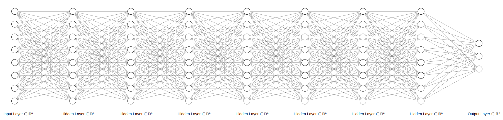
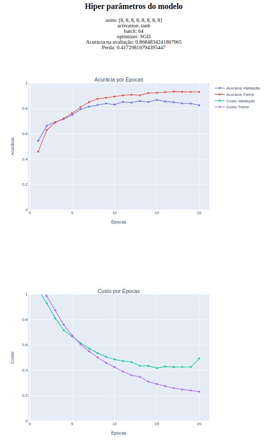

# NLP - Classificacao de Vagas

Este projeto é uma atividade da Especialização em Inteligência Artificial da PECE-Poli, disciplina de Processamento de Linguagem Natural.

O objetivo deste projeto é a criação de um modelo usando NLP capaz de receber uma descrição de vaga e retornar ao usuário qual é a visão do mercado sobre o título que este funcionário mais se adequa.

## Overview

A motivação deste projeto é como um possível auxílio para construção de equipes de dados por funcionários de RH. O usuário coloca como input do modelo a descrição do funcionário que ele está procurando e o modelo retorna qual título este funcionário mais se adequa em uma equipe de dados, classificando a vaga entre Data Scientist, Data Analyst ou Data Engineer.

O projeto foi desenvolvido a partir de três etapas:
1. Data Scraping do Linkedin para a criação do dataset;
2. Criação de um modelo de Deep Learning para classificação multi-classes;
3. Criação de um webapp para a interação mais fluida com o modelo usando Streamlit.

## 1. Dataset
O Dataset foi criado utilizando [Selenium](https://github.com/SeleniumHQ/selenium/tree/trunk/py) a partir de um script de scraping disponível no arquivo `scraper/scraper.py` .

O processo consistiu em pesquisar por vagas de Data Scientist, Data Analyst e Data Engineer (mil de cada título, um título por vez), e buscar a descrição de cada vaga conforme fornecido pela empresa contratante.

O Dataset será disponibilizado somente para o avaliador do projeto, uma vez que não foram solicitadas as autorizações do Linkedin para a realização do scraping e tampouco das empresas envolvidas.

## 2. Modelo
O modelo foi criado utilizando [Tensorflow Keras](https://github.com/tensorflow/tensorflow/) e outros métodos abordados durante o curso.

Para o tuning de hiperparâmetros foi desenvolvido um método personalizado de gridsearch com a criação de um relatório interativo para a obtenção de um modelo com a melhor arquitetura encontrada. O arquivo com todos os testes realizados (mais de 400MB) pode ser solicitado caso necessário, mas um exemplo pequeno deste relatório está disponível no arquivo `tuning-process-report.html.`

A melhor arquitetura de modelo encontrada foi com os seguintes hiperparâmetros:
- 6 camadas ocultas, com 8 neurônios cada;
- função de ativação tanh;
- batch_size=64;
- função de custo SGD.

Diagrama do modelo escolhido, com exatidão de 86.85% na base de validação.

Recorte do relatório de tuning com o modelo vencedor.

## 3. Webapp Streamlit

Para a interação mais fluida com o modelo foi criado um webapp usando Streamlit e disponibilizado via Heroku pela url TODO (projeto blablabla ) onde o usuário pode escolher entre exemplos simples, exemplos tirados do Linkedin que não estão na base de treino nem de teste ou um input manual.

O webapp é extremamente simples e serve como prova de conceito, basta escolher entre as opções e o dashboard criará um gráfico de barras mostrando a probabilidade estimada pelo modelo entre os três títulos possíveis.

